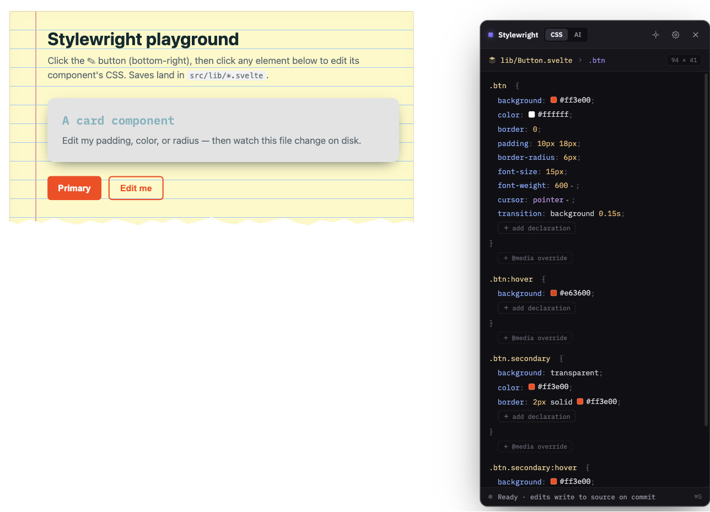
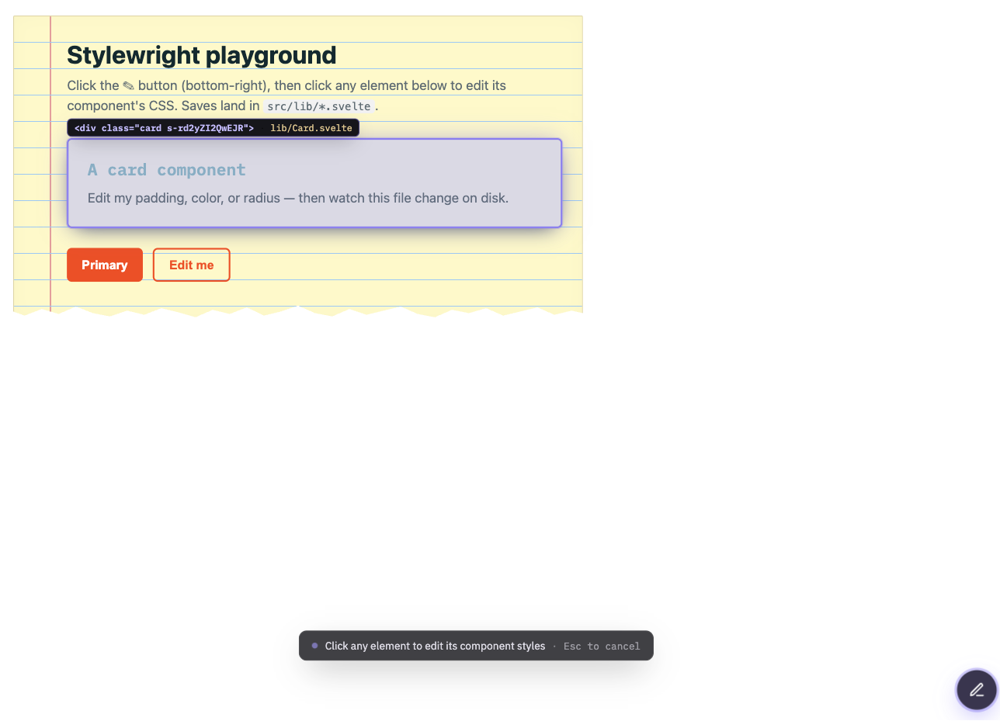
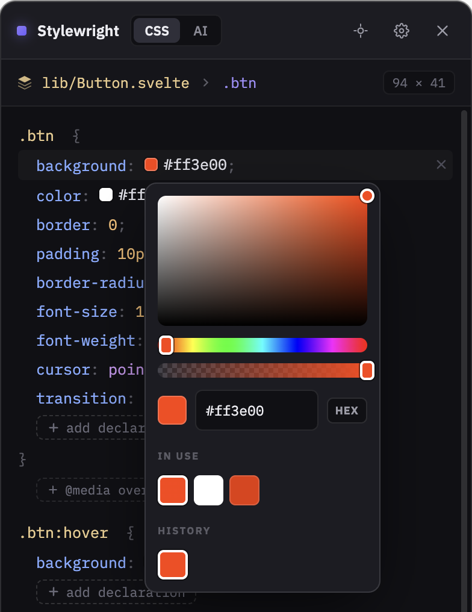
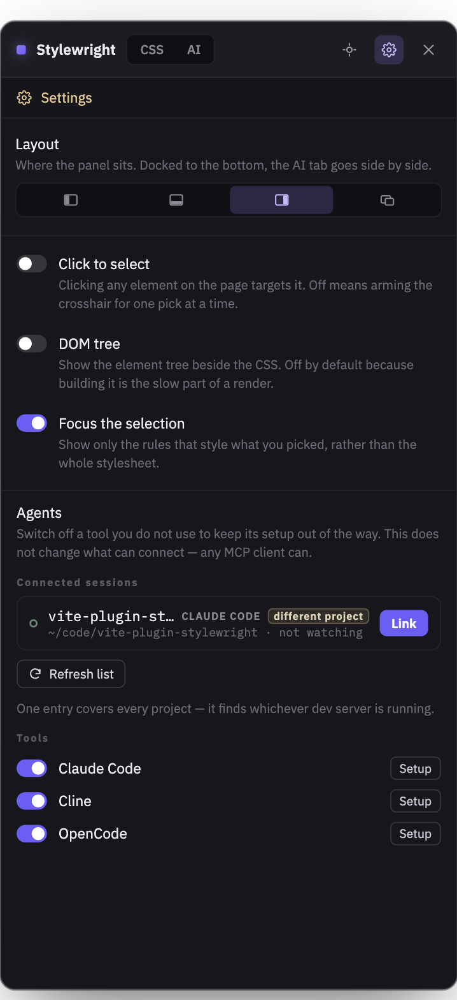
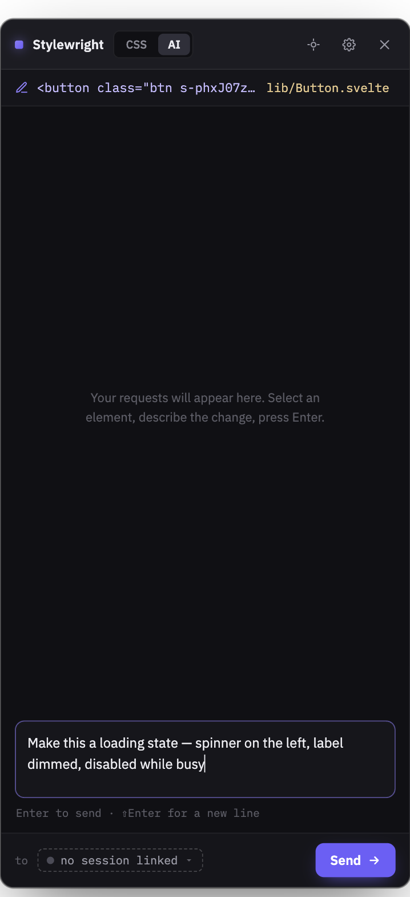
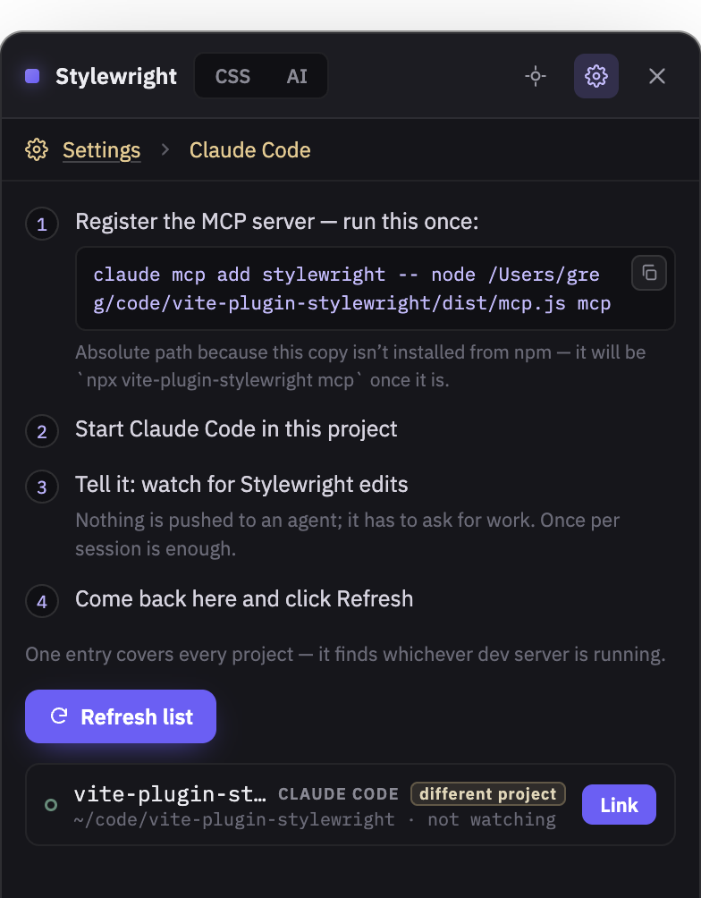

# vite-plugin-stylewright

> Edit a Svelte component's CSS live in the browser — and save it straight back into the `.svelte` `<style>` block.

A dev-only Vite plugin. Click an element on the page, tweak its CSS with live preview, hit save, and the change lands in your component's source. No copy-pasting out of DevTools, no losing your tweaks on reload.

```
  ✎  pick an element  →  edit its <style> rules  →  save  →  written to source + HMR
```



**Status:** early alpha (`0.0.x`). The core round-trip is solid and unit-tested; the browser overlay is functional and evolving. Issues and PRs welcome.

---

## Why this doesn't already exist

Chrome DevTools can't save CSS edits back to Svelte components, for two structural reasons:

1. **DevTools "save to source" is built for whole-file stylesheets** — a `.css`/`.scss` served as a `<link>`, or one a source map points to as a complete file. A Svelte `<style>` is a *CSS region embedded inside a mixed `.svelte` file*; DevTools has nowhere to write it.
2. **Vite serves all CSS in dev as JavaScript-injected `<style>` blocks** (for HMR), which DevTools treats as read-only for persistence.

Stylewright owns the round-trip end-to-end instead: a browser overlay captures the edit, and a **dev-server-only** endpoint patches the exact declaration back into your `.svelte` source with a real CSS parser — so nothing but the bytes you changed ever move.

## Install

```bash
npm i -D vite-plugin-stylewright
```

```js
// vite.config.js  (plain Svelte + Vite)
import { defineConfig } from 'vite';
import { svelte } from '@sveltejs/vite-plugin-svelte';
import stylewright from 'vite-plugin-stylewright';

export default defineConfig({
  plugins: [svelte(), stylewright()],
});
```

```js
// vite.config.js  (SvelteKit)
import { sveltekit } from '@sveltejs/kit/vite';
import stylewright from 'vite-plugin-stylewright';

export default defineConfig({
  plugins: [sveltekit(), stylewright()],
});
```

Run your dev server — a **✎** button appears bottom-right.

## Use

1. Click **✎**, then click any element on the page.
2. Stylewright finds the component that element belongs to and lists its `<style>` rules.
3. Edit a value — it previews live.
4. Press **Enter** (or blur the field) — the value is written into that component's `.svelte` `<style>`, and Vite HMR repaints from source.



<sub>Pick mode names the element **and** the file that owns it before you commit to a click.</sub>



<sub>Colour values open a picker seeded with the palette the component already uses — no hunting for the hex you picked two edits ago.</sub>



<sub>The panel docks left, bottom, right or floating. **Focus the selection** — on by default —
lists only the rules that style what you picked instead of the whole stylesheet.</sub>

## Ask AI

Some changes aren't a CSS value — "make this a primary button with a loading spinner" is a
markup change, a state, and a style. The **Ask AI** tab hands the selected element, its
source file and its parsed style rules to **one deliberately linked** agent session — Claude
Code, Cline, OpenCode or Kimi Code — which makes the change under its own permission and diff
flow.

The overlay is an intent-capture surface. It never renders a conversation, never edits a
file itself, and never picks a session for you.



<sub>The composer, with the target element pinned above it. The chip names the session the
request will go to — hollow dot and "no session linked" until you link one.</sub>

### One-time setup

Each agent registers an MCP server differently — Claude Code has a CLI command; Cline,
OpenCode and Kimi Code are configured by file, in three different shapes. **The overlay's setup screen shows the right one for
whichever you pick, with the path already filled in for your install**, so if you're
running from a checkout rather than an npm install you get an absolute path instead of a
package name that would 404. Settings → Agents controls which tools are listed there.

One entry covers every project — the MCP server finds whichever dev server is running.



<sub>Settings → Agents → **Setup**. The command is generated for your install, so a checkout
gets an absolute path rather than an `npx` name that would 404.</sub>

<details open>
<summary><b>Claude Code</b></summary>

1. **Register the MCP server — run this once:**
   ```bash
   claude mcp add stylewright -- npx vite-plugin-stylewright mcp
   ```
2. **Start Claude Code in this project**
3. **Tell it: watch for Stylewright edits**
4. **Come back here and click Refresh**, then **Link** the session you want

</details>

<details open>
<summary><b>Cline</b></summary>

There is no `claude mcp add` equivalent — Cline is configured through its own UI or JSON.

1. **Add the MCP server in Cline:**
   MCP Servers icon → Configure → Configure MCP Servers, then paste:
   ```json
   {
     "mcpServers": {
       "stylewright": {
         "command": "npx",
         "args": [
           "vite-plugin-stylewright",
           "mcp"
         ],
         "timeout": 3600,
         "env": {
           "STYLEWRIGHT_WATCH_MS": "3540000"
         }
       }
     }
   }
   ```
2. **Start Cline in this project**
3. **Tell it: watch for Stylewright edits**
4. **Come back here and click Refresh**, then **Link** the session you want

`timeout` is in **seconds** and Cline kills a tool call when it expires, which ends the
agent's turn and means retyping step 3. The two values above are emitted together for that
reason: an hour-long timeout with the watch set to end a minute inside it. Cline's default
is 60s — leave it out and `stylewright_watch` falls back to ~50s and re-arms, which works
but interrupts far more often.

Note that Cline spawns MCP servers with a working directory of `/`, so a session is named
after the project it connected to rather than its cwd.

</details>

<details open>
<summary><b>OpenCode</b></summary>

1. **Add the MCP server in OpenCode:**
   Add to opencode.json (project root, or ~/.config/opencode/opencode.json):
   ```json
   {
     "$schema": "https://opencode.ai/config.json",
     "mcp": {
       "stylewright": {
         "type": "local",
         "command": [
           "npx",
           "vite-plugin-stylewright",
           "mcp"
         ],
         "enabled": true,
         "timeout": 3600000,
         "environment": {
           "STYLEWRIGHT_WATCH_MS": "3540000"
         }
       }
     }
   }
   ```
2. **Start OpenCode in this project**
3. **Tell it: watch for Stylewright edits**
4. **Come back here and click Refresh**, then **Link** the session you want

OpenCode's `timeout` is in **milliseconds** — unlike Cline's, which is in seconds. Leave it
out and a request dies at about 30 seconds, which means retyping step 3 twice a minute.
OpenCode also restarts its timer whenever the server reports progress, and `stylewright_watch`
heartbeats every 10 seconds, so in practice the watch runs to its own budget rather than the
client's.

</details>

<details open>
<summary><b>Kimi Code</b></summary>

Kimi has no `mcp add` subcommand; it reads a JSON file in the Claude shape.

1. **Add the MCP server in Kimi Code:**
   Create ~/.kimi-code/mcp.json (user-global), or .kimi-code/mcp.json in the project — Kimi ships with neither:
   ```json
   {
     "mcpServers": {
       "stylewright": {
         "command": "npx",
         "args": [
           "vite-plugin-stylewright",
           "mcp"
         ],
         "toolTimeoutMs": 3600000,
         "env": {
           "STYLEWRIGHT_WATCH_MS": "3540000"
         }
       }
     }
   }
   ```
2. **Start Kimi Code in this project**
3. **Tell it: watch for Stylewright edits**
4. **Come back here and click Refresh**, then **Link** the session you want

`toolTimeoutMs` is in **milliseconds**, like OpenCode's `timeout` and unlike Cline's seconds.
Leave it out and the MCP SDK's own 60-second default applies, which means retyping step 3
every minute.

Unlike OpenCode, Kimi does **not** restart that timer when the server reports progress — it
never asks the SDK to — so the heartbeat buys nothing and `toolTimeoutMs` is a hard ceiling on
a single watch. That is why the value above is an hour rather than something smaller.

Kimi also reads a project-root `.mcp.json` in the same shape, so if you already keep one for
another tool, Stylewright is picked up from there with no second entry. The file above is
Kimi's own, which is the safer place to paste when you do not want to change what other tools
load.

</details>

Then select an element, switch to **Ask AI**, type an instruction, press Enter.

### Why step 3 exists

**An MCP server cannot make an idle agent start working.** Nothing is pushed into your
session — the agent has to *ask* for work by calling `stylewright_watch`. That's the whole
reason for the "watch for Stylewright edits" step.

Once per session is enough: the tool re-arms itself after each request. Until it is
watching, the overlay says so rather than queueing a prompt nobody will claim — the chip's
dot is hollow, and the composer tells you the phrase to type.

### If you're developing the plugin itself

Your agent spawns the MCP server **once** and holds that process. `npm run build` writes a
new `dist/mcp.js`, but the running process already has the old code in memory — so none of
your changes apply until the agent restarts the server. Toggle it off/on in Cline's MCP
panel, or run `claude mcp remove stylewright && claude mcp add …`. Reloading the page or
restarting the dev server does **not** do it.

### If a session doesn't appear

The MCP server logs to stderr, which every supported agent shows in its MCP server
panel. On success you'll see the project it connected to:

```
[stylewright] connected to http://127.0.0.1:5173 (root /path/to/app) as "app" — link it in the Stylewright overlay
```

If it can't find a dev server, or several could match, it says which and what to do.

### What the agent gets

| | |
|---|---|
| `source.file` | the `.svelte` file that owns the element, resolved the same way the CSS editor resolves it |
| `element` | tag, classes, a CSS path within the component, text, size |
| `context.styleRules` | the component's **real parsed CSS**, including its `@media` chain — so the agent edits the right rule instead of guessing |
| `context.outerHTML` | ≤ 4 KB, truncated on a tag boundary |
| `page` | route, viewport, colour scheme, previewed breakpoint |

### Status is never invented

The panel shows only what the agent reported. If it never reports, the request stays
`working` — there is no timer that decides it probably finished, and no file-watch
heuristic that guesses. `done`, `needs_input` and the file list all come from an explicit
`stylewright_report` call.

### Turning it off

```js
stylewright({ ai: false })   // no tab, no routes, no lockfile
```

## Try it in 30 seconds

A runnable Svelte 5 demo lives in [`playground/`](./playground):

```bash
git clone https://github.com/Greg-J/vite-plugin-stylewright
cd vite-plugin-stylewright
npm install && npm run build
cd playground && npm install && npm run dev
```

Open the printed URL, click **✎**, click the button or card, and edit away. Watch `playground/src/lib/*.svelte` change on disk as you save.

## How it works

| Step | Mechanism |
|------|-----------|
| **Which element / which file** | Svelte dev source metadata (`__svelte_meta`) — the same source-location data the Svelte inspector uses. |
| **Which rules** | The dev server reads the component, locates its `<style>` block, and parses it with [PostCSS](https://postcss.org/). |
| **The write-back** | The matched declaration is updated in the PostCSS tree, stringified, and spliced back at exact offsets with [magic-string](https://github.com/Rich-Harris/magic-string) — surrounding markup, script, and other CSS are untouched. |
| **Safety** | The write endpoint exists only on the dev server (never in a production build) and refuses any path that isn't a `.svelte` file inside your project root. |

## Options

```js
stylewright({
  enabled: true, // master switch (dev-only regardless)
})
```

## Security

Stylewright's dev server writes to your source tree, and any page in your browser can
reach `localhost` by URL. The API is therefore gated, not merely obscure:

- **Same-origin only.** A request carrying a cross-origin `Origin` is refused.
- **No attacker-controlled `Host`.** Only IP literals and `*.localhost` are served, so
  `evil.com` re-resolved to `127.0.0.1` (DNS rebinding) never reaches the API — which is
  what would otherwise defeat the origin check. `vite --host` still works: that arrives
  with an IP literal.
- **Writes need a header no `<form>` can set** (`x-stylewright: 1`), so a cross-site POST
  cannot rewrite your components.
- **Path containment is checked twice** — lexically, then again after resolving symlinks.
  A symlink inside the project pointing outside it is refused.
- **The agent routes need a loopback socket and the token**, and reject anything
  carrying a browser `Origin`. The token lives in `~/.stylewright/servers/` (`0600` in a
  `0700` directory), deliberately **not** under the Vite root — a credential inside the
  served tree would be handed to any unauthenticated GET, which no file mode can prevent.
- **`POST /style` refuses any payload containing `</style>`.** That route splices text
  into the component verbatim, so without the check it was a source-injection primitive
  rather than a CSS write.
- **The broker never writes files.** It queues text; every write is the agent's, under the
  agent's own permission and diff flow.
- **One outbound request:** IBM Plex from Google Fonts, for the overlay chrome. Turn it off
  with `stylewright({ fonts: false })`. There is no telemetry.

Dev-only throughout: `apply: 'serve'`, so none of it can reach a production build.

One thing to be aware of rather than protected from: an **Ask AI** request includes the
selected element's markup and text, so if you are previewing untrusted content (a page
rendering someone else's user-generated text) that content reaches your agent's context and
could contain instructions aimed at it. Select elements you'd be willing to paste into your
own session.

## Limitations (alpha)

- Targets **Svelte + Vite**. Element→source resolution relies on Svelte dev metadata.
- Edits the **first rule** matching a selector; descendant/complex selectors preview approximately.
- One `<style>` block per component (the common case).
- Preprocessor CSS (`lang="scss"`) is located and value-edits work, but structural rewrites are out of scope.
- **Ask AI** targets Claude Code, Cline, OpenCode and Kimi Code over MCP. Driving a local model directly is out
  of scope: there would be no session to link, and the plugin would have to own the write
  and the diff approval — which is the one thing this design refuses to do.
- One AI request in flight at a time.

## Roadmap

- Preprocessor-based element stamping as a fallback when `__svelte_meta` is unavailable.
- Multi-`<style>` and nested-rule support.
- Bundle IBM Plex locally so the overlay makes no outbound request at all.
- Answer an agent's clarifying question from the overlay (needs MCP elicitation).
- Light-mode token map for the overlay chrome.

## Contributing

```bash
npm install
npm run build      # tsup -> dist (plugin + client overlay)
npm test           # vitest (the patch/locate core)
npm run typecheck
```

PRs and issues welcome — this is meant to be a community tool.

## License

MIT © Greg Johnson
